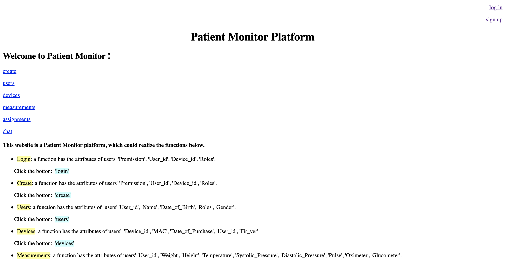
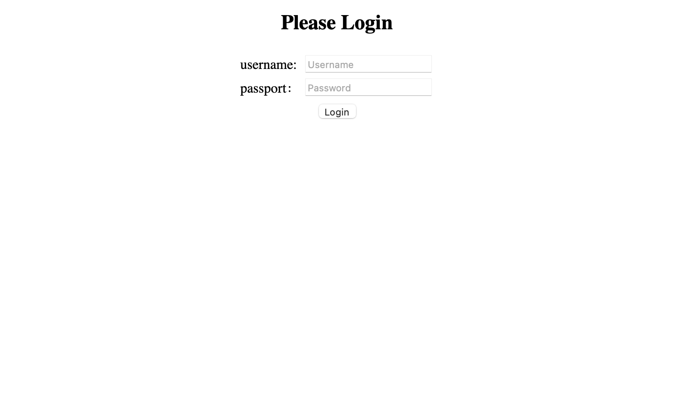
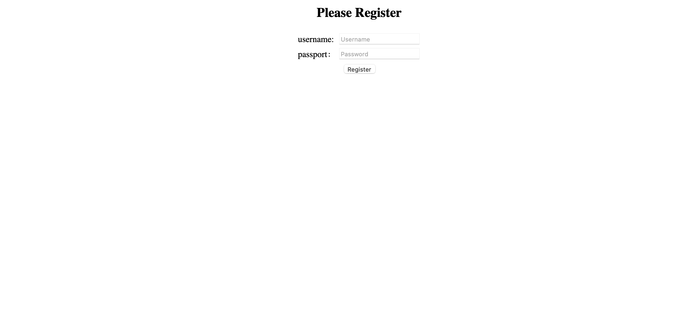

# Patients Monitor Platform

## Design of Patients Monitor Platform
- All the funtions' entrances of this platform are shown on the home page, and there the description of the platform is also on the home page.
- Users are able to go to different tables to complete their data through clicking different hyperlinks.
- The design of Patients Monitor Platform is made up of two parts, `Login` part, `Device` part and `Chat` part. Flask is used to implement the functions in this project. `application.py` is the file that composes the these parts into an application, by using flask.

## Login

Flask-login provides common Login tasks, such as Login and logout and the current user, through a user session.



After the user submits the username and password, we need to verify that the username and password are correct. In order to compare, there should be a place to store the user name and password in our system, and the background system will store it through the database.



After login, we need to maintain the user login state, so that the user can determine whether the user has logged in when visiting a specific web page, and whether the user has access to change the web page. This needs to maintain a session to save the user login state and user information.

When the request arrives, we will first check the user's information, such as whether they have logged in, whether they have permission, etc. If the check is passed, the corresponding webpage will be replied to the user in response. But if the check fails, an error message needs to be returned. If a wrong username or password is submitted, we use flash to show the wrong message.


Flask-wtf and WTF are used to implement forms functions. Flask-wtf does some encapsulation of WTF. Flask-wtf and WTF are mainly used to establish the correspondence between HTML elements and Python classes, and control HTML elements by manipulating corresponding classes or objects in Python code. We need to use flask-wtf and WTF in Python code to define the front page form (essentially a form class) and pass the corresponding form object as an argument to render_template. J then renders the corresponding template into HTML text and returns it to the user as an HTTP response.

```Python
# forms.py
from flask_wtf import FlaskForm
from wtforms import StringField, BooleanField, PasswordField
from wtforms.validators import DataRequired

class LoginForm(FlaskForm):
    username = StringField('User Name', validators=[DataRequired()])
    password = PasswordField('Password', validators=[DataRequired()])
    remember_me = BooleanField('remember me', default=False)

```

```Python
@application.route('/login', methods=['GET', 'POST'])
def login():
    if request.method == 'POST':
        user_id = request.form.get('userid')
        user = query_user(user_id)
        if user is not None and request.form['password'] == user['password']:

            curr_user = User()
            curr_user.id = user_id

            login_user(curr_user)

            return redirect(url_for('index'))

        flash('Wrong username or password!')
    return render_template('login.html')
```

## Register
For the registration part, we need to store passwords. However, if the username and password are simply stored in plain text, user information may be leaked. In this case, encrypt the user name before storing it. We can start by defining a User class that handles user-specific operations, including storage and validation.


The User class needs to inherit the UserMixin class from flask-Login for User session management. We store user information directly into a JSON file. Instead of storing passwords directly, we store encrypted hash values, using the generate_password_hash function in the Werkzeug. Security package. Since this function uses the SHA1 algorithm by default and adds a salt value of length 8, it is quite safe. It's good enough for general purposes. To verify the password, use the check_password_hash function in the Werkzeug. Security package to verify the password.

```Python
# models.py

from werkzeug.security import generate_password_hash
from werkzeug.security import check_password_hash
from flask_login import UserMixin
import json
import uuid

# define profile.json constant, the file is used to
# save user name and password_hash
PROFILE_FILE = "profiles.json"

class User(UserMixin):
    def __init__(self, username):
        self.username = username
        self.id = self.get_id()

    @property
    def password(self):
        raise AttributeError('password is not a readable attribute')

    @password.setter
    def password(self, password):
        """save user name, id and password hash to json file"""
        self.password_hash = generate_password_hash(password)
        with open(PROFILE_FILE, 'w+') as f:
            try:
                profiles = json.load(f)
            except ValueError:
                profiles = {}
            profiles[self.username] = [self.password_hash,
                                       self.id]
            f.write(json.dumps(profiles))

    def verify_password(self, password):
        password_hash = self.get_password_hash()
        if password_hash is None:
            return False
        return check_password_hash(self.password_hash, password)

    def get_password_hash(self):
        """try to get password hash from file.

        :return password_hash: if the there is corresponding user in
                the file, return password hash.
                None: if there is no corresponding user, return None.
        """
        try:
            with open(PROFILE_FILE) as f:
                user_profiles = json.load(f)
                user_info = user_profiles.get(self.username, None)
                if user_info is not None:
                    return user_info[0]
        except IOError:
            return None
        except ValueError:
            return None
        return None

    def get_id(self):
        """get user id from profile file, if not exist, it will
        generate a uuid for the user.
        """
        if self.username is not None:
            try:
                with open(PROFILE_FILE) as f:
                    user_profiles = json.load(f)
                    if self.username in user_profiles:
                        return user_profiles[self.username][1]
            except IOError:
                pass
            except ValueError:
                pass
        return unicode(uuid.uuid4())

    @staticmethod
    def get(user_id):
        """try to return user_id corresponding User object.
        This method is used by load_user callback function
        """
        if not user_id:
            return None
        try:
            with open(PROFILE_FILE) as f:
                user_profiles = json.load(f)
                for user_name, profile in user_profiles.iteritems():
                    if profile[1] == user_id:
                        return User(user_name)
        except:
            return None
        return None
```

### Logout

```Python
@application.route('/logout')
def logout():
    logout_user()
    return render_template('index.html')
```
We have achieved a complete login and logout process.

##
http://flask-env.eba-n2ygvpns.us-west-2.elasticbeanstalk.com/

## Design of Device Module
- `table.py` is the program to create the tables and insert the initial data.
	```Python
	cur.execute('CREATE TABLE Users(User_id INTEGER PRIMARY KEY, Name TEXT, Date_of_Birth TEXT, Roles TEXT, Gender TEXT)')
	cur.execute('CREATE TABLE Devices(Device_id INTEGER PRIMARY KEY, MAC TEXT, Date_of_Purchase TEXT, User_id INTEGER, Fir_ver TEXT)')
	cur.execute('CREATE TABLE Measurements(User_id INTEGER PRIMARY KEY, Weight REAL, Height REAL, Temperature REAL, Systolic_Pressure REAL, Diastolic_Pressure REAL, Pulse REAL, Oximeter REAL, Glucometer REAL)')
	cur.execute('CREATE TABLE Assignments(Device_id INTEGER PRIMARY KEY, User_id INTEGER, Assigner_id INTEGER, Date_Assigned TEXT)')
	cur.execute('CREATE TABLE Storage(Premission INTEGER PRIMARY KEY AUTOINCREMENT, User_id INTEGER, Device_id INTEGER, Roles TEXT)')
	```
- `Device_Module.py` is the code of inserting the table of Device messages. There is defalut data in the table, which is created in `table.py`. In device part, five tables have been created: `Users`, `Devices`, `Measurements`, `Assignments`, and `Storage`.   
  - It has the function of checking if the data works.
  ``` Python   
    def check_user_id(self):
        if self.user_id in self.user_id_list:
            self.logger.error("The user id has been recorded.")
        elif not isinstance(self.user_id, int):
            self.logger.error("The format of user id is wrong.")
        else:
            return True

    def check_device_id(self):
        if self.device_id in self.device_id_list:
            self.logger.error("The device id has been recorded.")
        elif not isinstance(self.device_id, int):
            self.logger.error("The format of device id is wrong.")
        else:
            return True   

    def check_role(self):
        roles = ["Patient", "Doctor", "Nurse", "AI_Developer", "Administrator"]
        if self.role not in roles:
            self.logger.error("Your role is not acceptable.")
        else:
            return True
    ```
    - After checking the data, it will add the data into the tables.
    ``` Python
    def create_device(self, dt):
        Users = tuple(list(dt["Users"].values()))
        Devices = tuple(list(dt["Devices"].values()))
        Measurements = tuple(list(dt["Measurements"].values()))
        Assignments = tuple(list(dt["Assignments"].values()))

        conn = sqlite3.connect(self.db) # table.db
        cur = conn.cursor()

        sql_statement = 'INSERT INTO Users VALUES (?, ?, ?, ?, ?)'
        cur.executemany(sql_statement, [Users])

        sql_statement = 'INSERT INTO Devices VALUES (?, ?, ?, ?, ?)'
        cur.executemany(sql_statement, [Devices])

        sql_statement = 'INSERT INTO Measurements VALUES (?, ?, ?, ?, ?, ?, ?, ?, ?)'
        cur.executemany(sql_statement, [Measurements])
        
        sql_statement = 'INSERT INTO Assignments VALUES (?, ?, ?, ?)'
        cur.executemany(sql_statement, [Assignments])

        cur.execute(f'INSERT INTO Storage VALUES ((SELECT MAX(Premission) + 1 FROM Storage),{self.user_id}, {self.device_id}, "{self.role}")')

        conn.commit()
        conn.close
    ```
  - `flask_device.py`is the code of implementing the function of getting and posting the data of the tables. Users are able to get the data through go to the website http://flask-env.eba-unimkryi.us-east-2.elasticbeanstalk.com/ .
  ``` Python
   ... 
   def get_data(table, col):
	con = sqlite3.connect(db)
	con.row_factory = sqlite3.Row
	cur = con.cursor()
	num = 1
	data = {}

	for row in cur.execute(f'SELECT * FROM {table}'):
		dic = {}
		for i in range(len(row)):
			dic[col[i]] = row[i]				
		data[f'number {num} user'] = dic
		num += 1

	con.commit()
	con.close
	return data
   ...
  @application.route("/create", methods=["POST", "GET"])
  def Storage():
	if request.method == "POST":
		new_data = {"Storage":{'User_id': int(request.form['User_id']),
					'Device_id': int(request.form['Device_id']),
					'Roles': request.form['Roles']}}
		new_json = json.dumps(new_data)

		with open('new_json.json', 'w') as outfile:
			json.dump(new_json, outfile)

		p = Device('new_json.json')
		p.importdb(db)
		p.user_id = int(request.form['User_id'])
		p.device_id = int(request.form['Device_id'])
		p.role = request.form['Roles']
		#p.get_device(0)

		p.check_user_id()
		p.check_device_id()
		p.check_role()
		if ((p.check_user_id() and p.check_device_id() and p.check_role())!=True):
			return "There is something wrong in your infomation, please check it."
		
		conn = sqlite3.connect(db) # table.db
		cur = conn.cursor()
		cur.execute(f'INSERT INTO Storage VALUES ((SELECT MAX(Premission) + 1 FROM Storage),{p.user_id}, {p.device_id}, "{p.role}")')

		conn.commit()
		conn.close

		return new_data
	else:
			data = get_data("Storage", col_storage)
			return render_template("storage.html", data = data)
  
  @application.route("/users", methods=["POST", "GET"])
  def Users():
    ....
    
  @application.route("/devices", methods=["POST", "GET"])
  def Devices():
    ...

  @application.route("/measurements", methods=["POST", "GET"])
  def Measurements():
    ...
  @application.route("/assignments", methods=["POST", "GET"])
  def Assignments():
    ...
  ```
## Design of Chat Module
- `Chat_Module.py` is the code of building the table of Chat records. There is defalut data in the table. In chat part, there are two table: `User_UserId_Records` and `User_ConnectID_Records`. 
  - It has the function of checking if the data works.
  ``` Python
	def check(self, user_id, connect_id):
		if (isinstance(user_id, int) and isinstance(connect_id, int)):
			if (user_id != connect_id):
				return True
  ```
   - After checking the data, it will create the tables and add the data into them.
  ``` Python
  def create_tables(self, user_id, connect_id):
    ...
    
  def store_data(self, user_id, connect_id, message_type, content):
    ...
  ```
- `flask_chat` is the code of implementing the function of getting and posting the data of the tables. Users are able to get the data through go to the website http://flask-env.eba-unimkryi.us-east-2.elasticbeanstalk.com/ .
  - In the flask chat part, two tables are included into the same page.
  ``` Python
  @application.route("/chat", methods=["POST", "GET"])
  def chat():
    if request.method == "POST":
      user_id = int(request.form['User_id'])
      connect_id = int(request.form['Connect_id'])
      message_type = request.form['Message_Type']
      content = request.form['Content']
      #time = str(datetime.datetime.now())
      if(p.check(user_id, connect_id)):
        p.create_tables(user_id, connect_id)
        p.store_data(user_id, connect_id, message_type, content)
        data = {'Records':p.data_rec, 'Connects':p.data_con}
        return data

      else:
        return "things wrong"
    else:
        data = p.table_rec
        return render_template("chat.html", data = data)
  ```
## Branching Strategy
- In this project, the branches are created based on the features of the project. 
- Each branch fufills the corresponding Github Issue.
- Each branch inculdes the code of implementation and the unit test of it.
- When the branch has completed its tasks, it will be merged to main.

## Schema


